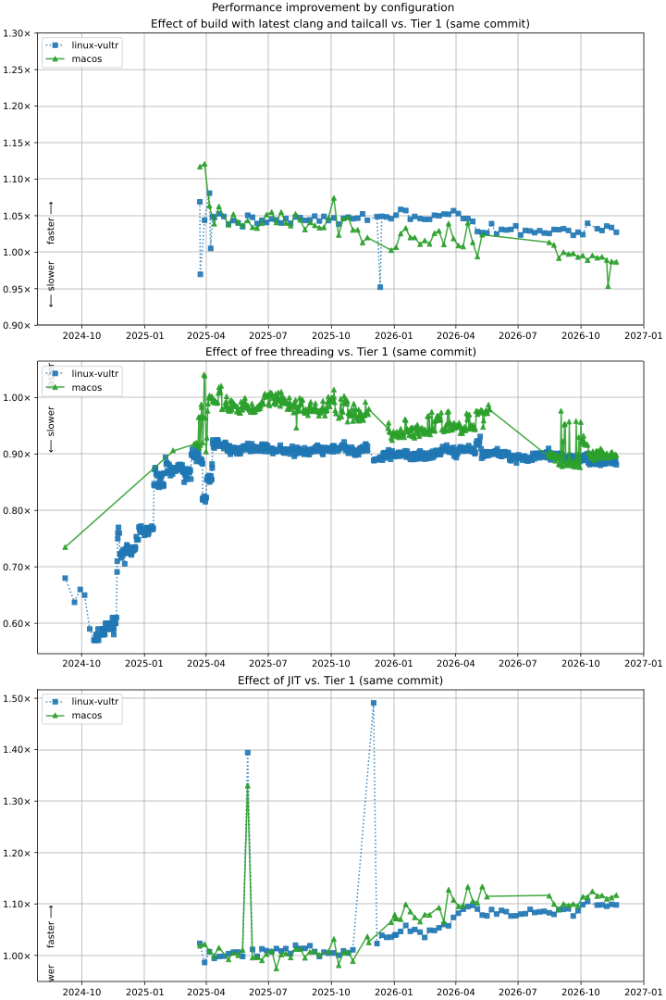

# Faster CPython Benchmark Infrastructure

🔒 [▶️ START A BENCHMARK RUN](../../actions/workflows/benchmark.yml)

## Results

Here are some recent and important revisions. 👉 [Complete list of results](RESULTS.md).

<!-- START table -->
- [Most recent  pystats on main (1cc5802)](results/bm-20261121-3.16.0a2%2Bdev-1cc5802/bm-20261121-vultr-x86_64-python-1cc580249141838a5208-3.16.0a2%2Bdev-1cc5802-pystats.md)
- [Most recent PYTHON_UOPS pystats on main (1cc5802)](results/bm-20261121-3.16.0a2%2Bdev-1cc5802-PYTHON_UOPS/bm-20261121-vultr-x86_64-python-1cc580249141838a5208-3.16.0a2%2Bdev-1cc5802-pystats.md)
- [Most recent JIT pystats on main (bedaea0)](results/bm-20251019-3.15.0a1%2B-bedaea0-JIT/bm-20251019-vultr-x86_64-python-bedaea05987738c4c6b9-3.15.0a1%2B-bedaea0-pystats.md)

## linux x86_64 (vultr)
| date | fork/ref | hash/flags | vs. 3.12.6: | vs. 3.13.0rc2: | vs. base: |
| --- | --- | --- | ---: | ---: | ---: |
| [2026-11-25](results/bm-20261125-3.16.0a2%2Bdev-cc0e59f-NOGIL) | python/cc0e59f17d0fcd8ed9f3 | cc0e59f (NOGIL) | 1.022x ↓<br>[📄](results/bm-20261125-3.16.0a2%2Bdev-cc0e59f-NOGIL/bm-20261125-vultr-x86_64-python-cc0e59f17d0fcd8ed9f3-3.16.0a2%2Bdev-cc0e59f-vs-3.12.6.md)[📈](results/bm-20261125-3.16.0a2%2Bdev-cc0e59f-NOGIL/bm-20261125-vultr-x86_64-python-cc0e59f17d0fcd8ed9f3-3.16.0a2%2Bdev-cc0e59f-vs-3.12.6.svg) | 1.056x ↓<br>[📄](results/bm-20261125-3.16.0a2%2Bdev-cc0e59f-NOGIL/bm-20261125-vultr-x86_64-python-cc0e59f17d0fcd8ed9f3-3.16.0a2%2Bdev-cc0e59f-vs-3.13.0rc2.md)[📈](results/bm-20261125-3.16.0a2%2Bdev-cc0e59f-NOGIL/bm-20261125-vultr-x86_64-python-cc0e59f17d0fcd8ed9f3-3.16.0a2%2Bdev-cc0e59f-vs-3.13.0rc2.svg) | 1.116x ↓<br>[📄](results/bm-20261125-3.16.0a2%2Bdev-cc0e59f-NOGIL/bm-20261125-vultr-x86_64-python-cc0e59f17d0fcd8ed9f3-3.16.0a2%2Bdev-cc0e59f-vs-base.md)[📈](results/bm-20261125-3.16.0a2%2Bdev-cc0e59f-NOGIL/bm-20261125-vultr-x86_64-python-cc0e59f17d0fcd8ed9f3-3.16.0a2%2Bdev-cc0e59f-vs-base.svg)[🧠](results/bm-20261125-3.16.0a2%2Bdev-cc0e59f-NOGIL/bm-20261125-vultr-x86_64-python-cc0e59f17d0fcd8ed9f3-3.16.0a2%2Bdev-cc0e59f-vs-base-mem.svg) |
| [2026-11-25](results/bm-20261125-3.16.0a2%2Bdev-cc0e59f) | python/cc0e59f17d0fcd8ed9f3 | cc0e59f | 1.101x ↑<br>[📄](results/bm-20261125-3.16.0a2%2Bdev-cc0e59f/bm-20261125-vultr-x86_64-python-cc0e59f17d0fcd8ed9f3-3.16.0a2%2Bdev-cc0e59f-vs-3.12.6.md)[📈](results/bm-20261125-3.16.0a2%2Bdev-cc0e59f/bm-20261125-vultr-x86_64-python-cc0e59f17d0fcd8ed9f3-3.16.0a2%2Bdev-cc0e59f-vs-3.12.6.svg) | 1.063x ↑<br>[📄](results/bm-20261125-3.16.0a2%2Bdev-cc0e59f/bm-20261125-vultr-x86_64-python-cc0e59f17d0fcd8ed9f3-3.16.0a2%2Bdev-cc0e59f-vs-3.13.0rc2.md)[📈](results/bm-20261125-3.16.0a2%2Bdev-cc0e59f/bm-20261125-vultr-x86_64-python-cc0e59f17d0fcd8ed9f3-3.16.0a2%2Bdev-cc0e59f-vs-3.13.0rc2.svg) |  |
| [2026-11-24](results/bm-20261124-3.16.0a2%2Bdev-ec053fe-NOGIL) | python/ec053fe99c93a79f21ce | ec053fe (NOGIL) | 1.022x ↓<br>[📄](results/bm-20261124-3.16.0a2%2Bdev-ec053fe-NOGIL/bm-20261124-vultr-x86_64-python-ec053fe99c93a79f21ce-3.16.0a2%2Bdev-ec053fe-vs-3.12.6.md)[📈](results/bm-20261124-3.16.0a2%2Bdev-ec053fe-NOGIL/bm-20261124-vultr-x86_64-python-ec053fe99c93a79f21ce-3.16.0a2%2Bdev-ec053fe-vs-3.12.6.svg) | 1.056x ↓<br>[📄](results/bm-20261124-3.16.0a2%2Bdev-ec053fe-NOGIL/bm-20261124-vultr-x86_64-python-ec053fe99c93a79f21ce-3.16.0a2%2Bdev-ec053fe-vs-3.13.0rc2.md)[📈](results/bm-20261124-3.16.0a2%2Bdev-ec053fe-NOGIL/bm-20261124-vultr-x86_64-python-ec053fe99c93a79f21ce-3.16.0a2%2Bdev-ec053fe-vs-3.13.0rc2.svg) | 1.116x ↓<br>[📄](results/bm-20261124-3.16.0a2%2Bdev-ec053fe-NOGIL/bm-20261124-vultr-x86_64-python-ec053fe99c93a79f21ce-3.16.0a2%2Bdev-ec053fe-vs-base.md)[📈](results/bm-20261124-3.16.0a2%2Bdev-ec053fe-NOGIL/bm-20261124-vultr-x86_64-python-ec053fe99c93a79f21ce-3.16.0a2%2Bdev-ec053fe-vs-base.svg)[🧠](results/bm-20261124-3.16.0a2%2Bdev-ec053fe-NOGIL/bm-20261124-vultr-x86_64-python-ec053fe99c93a79f21ce-3.16.0a2%2Bdev-ec053fe-vs-base-mem.svg) |
| [2026-11-24](results/bm-20261124-3.16.0a2%2Bdev-ec053fe) | python/ec053fe99c93a79f21ce | ec053fe | 1.102x ↑<br>[📄](results/bm-20261124-3.16.0a2%2Bdev-ec053fe/bm-20261124-vultr-x86_64-python-ec053fe99c93a79f21ce-3.16.0a2%2Bdev-ec053fe-vs-3.12.6.md)[📈](results/bm-20261124-3.16.0a2%2Bdev-ec053fe/bm-20261124-vultr-x86_64-python-ec053fe99c93a79f21ce-3.16.0a2%2Bdev-ec053fe-vs-3.12.6.svg) | 1.065x ↑<br>[📄](results/bm-20261124-3.16.0a2%2Bdev-ec053fe/bm-20261124-vultr-x86_64-python-ec053fe99c93a79f21ce-3.16.0a2%2Bdev-ec053fe-vs-3.13.0rc2.md)[📈](results/bm-20261124-3.16.0a2%2Bdev-ec053fe/bm-20261124-vultr-x86_64-python-ec053fe99c93a79f21ce-3.16.0a2%2Bdev-ec053fe-vs-3.13.0rc2.svg) |  |
| [2026-11-24](results/bm-20261124-3.16.0a2%2Bdev-4ec6eb0-NOGIL) | python/4ec6eb0496922cb466a8 | 4ec6eb0 (NOGIL) | 1.025x ↓<br>[📄](results/bm-20261124-3.16.0a2%2Bdev-4ec6eb0-NOGIL/bm-20261124-vultr-x86_64-python-4ec6eb0496922cb466a8-3.16.0a2%2Bdev-4ec6eb0-vs-3.12.6.md)[📈](results/bm-20261124-3.16.0a2%2Bdev-4ec6eb0-NOGIL/bm-20261124-vultr-x86_64-python-4ec6eb0496922cb466a8-3.16.0a2%2Bdev-4ec6eb0-vs-3.12.6.svg) | 1.059x ↓<br>[📄](results/bm-20261124-3.16.0a2%2Bdev-4ec6eb0-NOGIL/bm-20261124-vultr-x86_64-python-4ec6eb0496922cb466a8-3.16.0a2%2Bdev-4ec6eb0-vs-3.13.0rc2.md)[📈](results/bm-20261124-3.16.0a2%2Bdev-4ec6eb0-NOGIL/bm-20261124-vultr-x86_64-python-4ec6eb0496922cb466a8-3.16.0a2%2Bdev-4ec6eb0-vs-3.13.0rc2.svg) | 1.114x ↓<br>[📄](results/bm-20261124-3.16.0a2%2Bdev-4ec6eb0-NOGIL/bm-20261124-vultr-x86_64-python-4ec6eb0496922cb466a8-3.16.0a2%2Bdev-4ec6eb0-vs-base.md)[📈](results/bm-20261124-3.16.0a2%2Bdev-4ec6eb0-NOGIL/bm-20261124-vultr-x86_64-python-4ec6eb0496922cb466a8-3.16.0a2%2Bdev-4ec6eb0-vs-base.svg)[🧠](results/bm-20261124-3.16.0a2%2Bdev-4ec6eb0-NOGIL/bm-20261124-vultr-x86_64-python-4ec6eb0496922cb466a8-3.16.0a2%2Bdev-4ec6eb0-vs-base-mem.svg) |
| [2026-11-24](results/bm-20261124-3.16.0a2%2Bdev-4ec6eb0) | python/4ec6eb0496922cb466a8 | 4ec6eb0 | 1.096x ↑<br>[📄](results/bm-20261124-3.16.0a2%2Bdev-4ec6eb0/bm-20261124-vultr-x86_64-python-4ec6eb0496922cb466a8-3.16.0a2%2Bdev-4ec6eb0-vs-3.12.6.md)[📈](results/bm-20261124-3.16.0a2%2Bdev-4ec6eb0/bm-20261124-vultr-x86_64-python-4ec6eb0496922cb466a8-3.16.0a2%2Bdev-4ec6eb0-vs-3.12.6.svg) | 1.058x ↑<br>[📄](results/bm-20261124-3.16.0a2%2Bdev-4ec6eb0/bm-20261124-vultr-x86_64-python-4ec6eb0496922cb466a8-3.16.0a2%2Bdev-4ec6eb0-vs-3.13.0rc2.md)[📈](results/bm-20261124-3.16.0a2%2Bdev-4ec6eb0/bm-20261124-vultr-x86_64-python-4ec6eb0496922cb466a8-3.16.0a2%2Bdev-4ec6eb0-vs-3.13.0rc2.svg) |  |

## darwin arm64 (macm4pro)
| date | fork/ref | hash/flags | vs. 3.12.6: | vs. 3.13.0rc2: | vs. base: |
| --- | --- | --- | ---: | ---: | ---: |
| [2026-11-24](results/bm-20261124-3.16.0a2%2Bdev-4ec6eb0-NOGIL) | python/4ec6eb0496922cb466a8 | 4ec6eb0 (NOGIL) | 1.075x ↑<br>[📄](results/bm-20261124-3.16.0a2%2Bdev-4ec6eb0-NOGIL/bm-20261124-macm4pro-arm64-python-4ec6eb0496922cb466a8-3.16.0a2%2Bdev-4ec6eb0-vs-3.12.6.md)[📈](results/bm-20261124-3.16.0a2%2Bdev-4ec6eb0-NOGIL/bm-20261124-macm4pro-arm64-python-4ec6eb0496922cb466a8-3.16.0a2%2Bdev-4ec6eb0-vs-3.12.6.svg) | 1.005x ↓<br>[📄](results/bm-20261124-3.16.0a2%2Bdev-4ec6eb0-NOGIL/bm-20261124-macm4pro-arm64-python-4ec6eb0496922cb466a8-3.16.0a2%2Bdev-4ec6eb0-vs-3.13.0rc2.md)[📈](results/bm-20261124-3.16.0a2%2Bdev-4ec6eb0-NOGIL/bm-20261124-macm4pro-arm64-python-4ec6eb0496922cb466a8-3.16.0a2%2Bdev-4ec6eb0-vs-3.13.0rc2.svg) | 1.097x ↓<br>[📄](results/bm-20261124-3.16.0a2%2Bdev-4ec6eb0-NOGIL/bm-20261124-macm4pro-arm64-python-4ec6eb0496922cb466a8-3.16.0a2%2Bdev-4ec6eb0-vs-base.md)[📈](results/bm-20261124-3.16.0a2%2Bdev-4ec6eb0-NOGIL/bm-20261124-macm4pro-arm64-python-4ec6eb0496922cb466a8-3.16.0a2%2Bdev-4ec6eb0-vs-base.svg)[🧠](results/bm-20261124-3.16.0a2%2Bdev-4ec6eb0-NOGIL/bm-20261124-macm4pro-arm64-python-4ec6eb0496922cb466a8-3.16.0a2%2Bdev-4ec6eb0-vs-base-mem.svg) |
| [2026-11-24](results/bm-20261124-3.16.0a2%2Bdev-4ec6eb0) | python/4ec6eb0496922cb466a8 | 4ec6eb0 | 1.195x ↑<br>[📄](results/bm-20261124-3.16.0a2%2Bdev-4ec6eb0/bm-20261124-macm4pro-arm64-python-4ec6eb0496922cb466a8-3.16.0a2%2Bdev-4ec6eb0-vs-3.12.6.md)[📈](results/bm-20261124-3.16.0a2%2Bdev-4ec6eb0/bm-20261124-macm4pro-arm64-python-4ec6eb0496922cb466a8-3.16.0a2%2Bdev-4ec6eb0-vs-3.12.6.svg) | 1.104x ↑<br>[📄](results/bm-20261124-3.16.0a2%2Bdev-4ec6eb0/bm-20261124-macm4pro-arm64-python-4ec6eb0496922cb466a8-3.16.0a2%2Bdev-4ec6eb0-vs-3.13.0rc2.md)[📈](results/bm-20261124-3.16.0a2%2Bdev-4ec6eb0/bm-20261124-macm4pro-arm64-python-4ec6eb0496922cb466a8-3.16.0a2%2Bdev-4ec6eb0-vs-3.13.0rc2.svg) |  |
| [2026-11-22](results/bm-20261122-3.16.0a2%2Bdev-22691a3-NOGIL) | python/22691a32b122cff3ad17 | 22691a3 (NOGIL) | 1.067x ↑<br>[📄](results/bm-20261122-3.16.0a2%2Bdev-22691a3-NOGIL/bm-20261122-macm4pro-arm64-python-22691a32b122cff3ad17-3.16.0a2%2Bdev-22691a3-vs-3.12.6.md)[📈](results/bm-20261122-3.16.0a2%2Bdev-22691a3-NOGIL/bm-20261122-macm4pro-arm64-python-22691a32b122cff3ad17-3.16.0a2%2Bdev-22691a3-vs-3.12.6.svg) | 1.013x ↓<br>[📄](results/bm-20261122-3.16.0a2%2Bdev-22691a3-NOGIL/bm-20261122-macm4pro-arm64-python-22691a32b122cff3ad17-3.16.0a2%2Bdev-22691a3-vs-3.13.0rc2.md)[📈](results/bm-20261122-3.16.0a2%2Bdev-22691a3-NOGIL/bm-20261122-macm4pro-arm64-python-22691a32b122cff3ad17-3.16.0a2%2Bdev-22691a3-vs-3.13.0rc2.svg) | 1.101x ↓<br>[📄](results/bm-20261122-3.16.0a2%2Bdev-22691a3-NOGIL/bm-20261122-macm4pro-arm64-python-22691a32b122cff3ad17-3.16.0a2%2Bdev-22691a3-vs-base.md)[📈](results/bm-20261122-3.16.0a2%2Bdev-22691a3-NOGIL/bm-20261122-macm4pro-arm64-python-22691a32b122cff3ad17-3.16.0a2%2Bdev-22691a3-vs-base.svg)[🧠](results/bm-20261122-3.16.0a2%2Bdev-22691a3-NOGIL/bm-20261122-macm4pro-arm64-python-22691a32b122cff3ad17-3.16.0a2%2Bdev-22691a3-vs-base-mem.svg) |


<!-- END table -->

`*` indicates that the exact same versions of pyperformance was not used.


Improvement of the geometric mean of key merged benchmarks, computed with `pyperf compare`.
The results have a resolution of 0.01 (1%).



## Documentation

### Running benchmarks from the GitHub web UI

Visit the 🔒 [benchmark action](../../actions/workflows/benchmark.yml) and click the "Run Workflow" button.

The available parameters are:

- `fork`: The fork of CPython to benchmark.
  If benchmarking a pull request, this would normally be your GitHub username.
- `ref`: The branch, tag or commit SHA to benchmark.
  If a SHA, it must be the full SHA, since finding it by a prefix is not supported.
- `machine`: The machine to run on.
  One of `linux-amd64` (default), `windows-amd64`, `darwin-arm64` or `all`.
- `benchmark_base`: If checked, the base of the selected branch will also be benchmarked.
  The base is determined by running `git merge-base upstream/main $ref`.
- `pystats`: If checked, collect the pystats from running the benchmarks.

To watch the progress of the benchmark, select it from the 🔒 [benchmark action page](../../actions/workflows/benchmark.yml).
It may be canceled from there as well.
To show only your benchmark workflows, select your GitHub ID from the "Actor" dropdown.

When the benchmarking is complete, the results are published to this repository and will appear in the [complete table](RESULTS.md).
Each set of benchmarks will have:

- The raw `.json` results from pyperformance.
- Comparisons against important reference releases, as well as the merge base of the branch if `benchmark_base` was selected. These include
  - A markdown table produced by `pyperf compare_to`.
  - A set of "violin" plots showing the distribution of results for each benchmark.

The most convenient way to get results locally is to clone this repo and `git pull` from it.

### Running benchmarks from the GitHub CLI

To automate benchmarking runs, it may be more convenient to use the [GitHub CLI](https://cli.github.com/).
Once you have `gh` installed and configured, you can run benchmarks by cloning this repository and then from inside it:

```bash session
gh workflow run benchmark.yml -f fork=me -f ref=my_branch
```

Any of the parameters described above are available at the commandline using the `-f key=value` syntax.

### Collecting Linux perf profiling data

To collect Linux perf sampling profile data for a benchmarking run, run the `_benchmark` action and check the `perf` checkbox.
Follow this by a run of the `_generate` action to regenerate the plots.

## License

This repo is licensed under the BSD 3-Clause License, as found in the LICENSE file.
